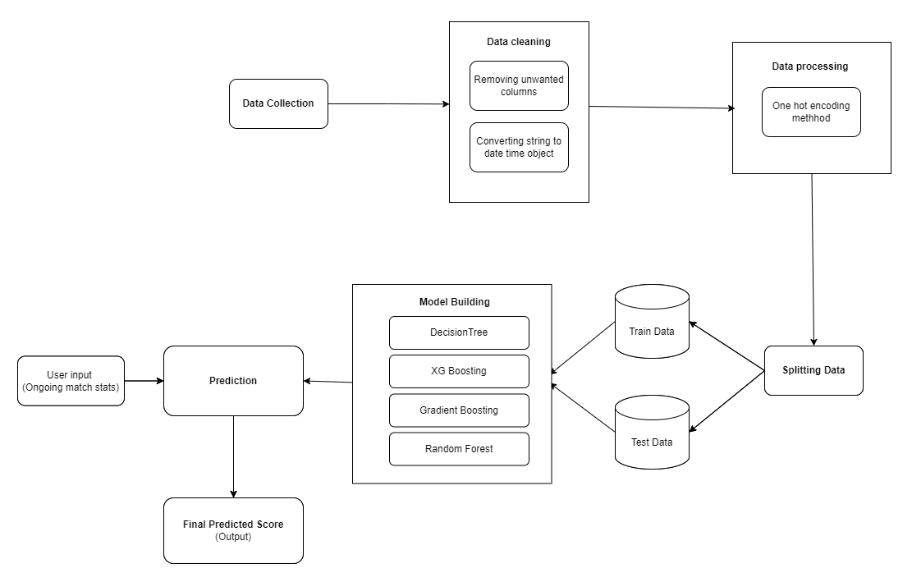
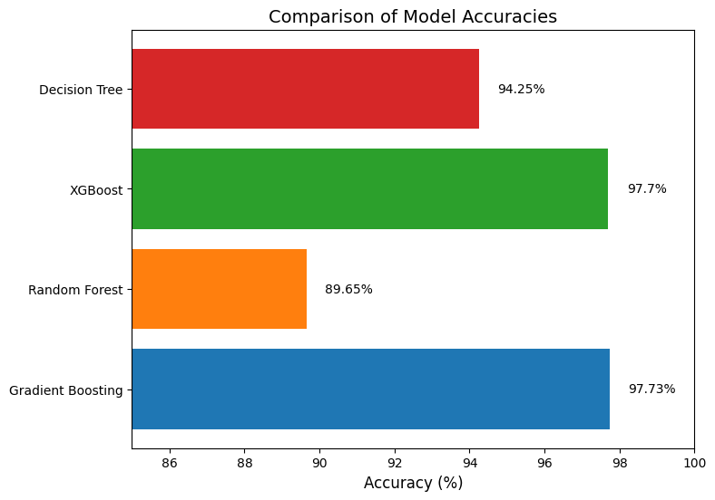

# BPL Match Result Prediction

This project aims to predict the outcomes of Bangladesh Premier League (BPL) cricket matches using machine learning models. It compares different models, including Gradient Boosting, Random Forest, XGBoost, and Decision Tree, to find the most accurate prediction method for match results.

## Methodology


## Dataset

The dataset used in this project is created by me and includes detailed information about BPL matches, such as team scores, player statistics, and match outcomes.

You can access the dataset [https://www.kaggle.com/datasets/minhajuddinhassan/bpl-dataset/data](https://www.kaggle.com/datasets/minhajuddinhassan/bpl-dataset/data).

## Getting Started

### Prerequisites

- Python 3.x
- Jupyter Notebook (optional)
- Required libraries: `pandas`, `numpy`, `sklearn`, `matplotlib`, `seaborn`, `xgboost`

### Installation

1. Clone the repository:
   ```bash
   git clone https://github.com/muhpuc40/BPL_Match_Result_Prediction.git
   ```
2. Download the dataset from the link provided and place it.

### Usage

- Run the Jupyter notebooks to see the data analysis, model training, and evaluation steps.
- Modify the parameters in the model training files to test different models or tune the existing models.

## Results
### Model Accuracy

The accuracy achieved by different models is as follows:

- Gradient Boosting: **97.73%**
- Random Forest: **89.65%**
- XGBoost: **97.70%**
- Decision Tree: **94.25%**


The results of the model comparison indicate that the Gradient Boosting algorithm is the most accurate for predicting BPL match outcomes, achieving an accuracy of **97.73%**.
