> PREMIER UNIVERSITY Department of Computer Science and Engineering
>
> BPL MATCH WINNER PREDICTION
>
> FINAL REPORT
>
> Course Code : CSE 318(V3)
>
> Course Title :
>
> Submitted To: Adiba Ibnat Hossain Lecturer Department Of CSE

Artificial Intelligence Laboratory

> Submitted By: Minhaj Uddin Hassan 2104010202211
>
> Md. Imtiaz Uddin 21040102214 Avirup Rakshit 2104010202227
>
> Contribution

||
||
||

> Submission Date: 13’SEPTEMBER 2024
>
> Abstract
>
> This project investigates the application of machine learning methods
> to forecast the results of Bangladesh Premier League (BPL) cricket
> games. Utilizing historical match data and key features like team
> performance and match venue, we create a thorough dataset. We then use
> advanced machine learning models such as XGBoost, Random Forest,
> Decision Tree, and Gradient Boosting to build predictive models. The
> objective is to offer precise forecasts of game outcomes, increasing
> fan involvement and aiding teams in strategic decision-making. The
> high accuracy of our models shows that machine learning is effective
> in dealing with the complexities and uncertainties of cricket. The
> results not only add to sports analytics but also create possibilities
> for future research, aiming to enhance real-time prediction abilities
> and address the game’s dynamic nature.
>
> i
>
> CONTENTS
>
> 1 Introduction 1 1.1 Motivation . . . . . . . . . . . . . . . . . . .
> . . . . . . . . . . . . . . . . . 1 1.2 Objective . . . . . . . . . .
> . . . . . . . . . . . . . . . . . . . . . . . . . . . 2 1.2.1 Creation
> of a Novel Dataset . . . . . . . . . . . . . . . . . . . . . . . 3
>
> 1.2.2 Improvement of Model Accuracy . . . . . . . . . . . . . . . . .
> . . . 3 1.3 Dificulties . . . . . . . . . . . . . . . . . . . . . . .
> . . . . . . . . . . . . . . 3 1.4 Related Work . . . . . . . . . . . .
> . . . . . . . . . . . . . . . . . . . . . . . 3 1.5 Report
> Organization . . . . . . . . . . . . . . . . . . . . . . . . . . . . .
> . . 4
>
> 2 Literature Review 5
>
> 3 Methodology 7 3.1 Work Flow . . . . . . . . . . . . . . . . . . . .
> . . . . . . . . . . . . . . . . 7 3.2 Data Collection and Preparation
> . . . . . . . . . . . . . . . . . . . . . . . . 8
>
> 3.3 Feature Selection and Engineering 3.4 Model Selection and
> Development

. . . . . . . . . . . . . . . . . . . . . . . 8 . . . . . . . . . . . .
. . . . . . . . . . . 9

> 3.4.1 Model : Decision Tree . . . . . . . . . . . . . . . . . . . . .
> . . . . . 9 3.4.2 Model : XG Boosting Classifier . . . . . . . . . . .
> . . . . . . . . . . 10 3.4.3 Model : Gradient Boosting Classifier . .
> . . . . . . . . . . . . . . . . 11 3.4.4 Model : Random Forest
> Classifier . . . . . . . . . . . . . . . . . . . . 12
>
> 4 Implementation 14 4.1 System Requirements . . . . . . . . . . . . .
> . . . . . . . . . . . . . . . . . 14 4.1.1 Operating System . . . . .
> . . . . . . . . . . . . . . . . . . . . . . . 14
>
> 4.1.2 Integrated Development Environment (IDE) . . . . . . . . . . . .
> . . 14 4.1.3 Language and Libraries . . . . . . . . . . . . . . . . .
> . . . . . . . . 14
>
> 4.2 Dataset Description . . . . . . . . . . . . . . . . . . . . . . .
> . . . . . . . . 15 4.2.1 Data Types . . . . . . . . . . . . . . . . .
> . . . . . . . . . . . . . . . 15 4.2.2 Data Size . . . . . . . . . . .
> . . . . . . . . . . . . . . . . . . . . . . 15
>
> 4.3 Mapping . . . . . . . . . . . . . . . . . . . . . . . . . . . . .
> . . . . . . . . . 16 4.4 Data Preprocessing . . . . . . . . . . . . .
> . . . . . . . . . . . . . . . . . . . 17 4.5 Label Encoding . . . . .
> . . . . . . . . . . . . . . . . . . . . . . . . . . . . . 18 4.6 Model
> Application . . . . . . . . . . . . . . . . . . . . . . . . . . . . .
> . . . 19 4.6.1 Decision Tree : Model Training & Testing . . . . . . .
> . . . . . . . . 20 4.6.2 XG Boosting Classifier : Model Training &
> Testing . . . . . . . . . . 22 4.6.3 Gradient Boosting Classifier :
> Model Training & Testing . . . . . . . 23 4.6.4 Random Forest
> Classifier : Model Training & Testing . . . . . . . . 24
>
> ii
>
> CONTENTS BPL MATCH WINNER PREDICTION
>
> 5 Result Analysis 27 5.1 Performance Evaluation . . . . . . . . . . .
> . . . . . . . . . . . . . . . . . . 27 5.1.1 Decision Tree Performance
> . . . . . . . . . . . . . . . . . . . . . . . 27
>
> 5.1.2 XGBoost Performance . . . . . . . . . . . . . . . . . . . . . .
> . . . . 28 5.1.3 Random Forest Performance . . . . . . . . . . . . . .
> . . . . . . . . 29 5.1.4 Gradient Boosting Performance . . . . . . . .
> . . . . . . . . . . . . . 30
>
> 5.2 Model Accuracy & Compare . . . . . . . . . . . . . . . . . . . . .
> . . . . . . 32 5.3 Output . . . . . . . . . . . . . . . . . . . . . .
> . . . . . . . . . . . . . . . . 32 5.4 Output Verification . . . . . .
> . . . . . . . . . . . . . . . . . . . . . . . . . . 33
>
> 6 Future Scope 34
>
> 7 Limitations 36
>
> 8 Conclusion 38
>
> iii
>
> CHAPTER 1
>
> INTRODUCTION
>
> SportsinBangladeshareapopularformofentertainmentandanessentialpartofBangladeshi
> culture. Cricket, being the most popular sport in the country, has a
> special place in the hearts of Bangladeshis. The Bangladesh Premier
> League (BPL), one of the three pro-fessional cricket leagues in
> Bangladesh \[22\], stands out as a significant sporting event. Formed
> in 2012 by the Bangladesh Cricket Board, the BPL is renowned for its
> exciting Twenty20 format. Notably, it ranks as the 16th most attended
> premier league in the world, reflecting its popularity and
> significance.
>
> 1.1 Motivation
>
> In recent years, technology and media have further fueled the growth
> of cricket by mak-ing live matches and updates easily accessible
> through live streaming, social media, and mobile applications. This
> advancement has expanded the sport’s reach and allowed fans to engage
> with cricket in unprecedented ways. The Bangladesh Premier League
> (BPL), a professional T20 cricket league launched in 2012, has
> capitalized on this trend, operat-ing on a franchise-based business
> model that has attracted significant investments. The BPL has become a
> major sporting event in Bangladesh, drawing massive viewership and
> generating substantial economic impact.
>
> The motivation behind this project stems from a passion for cricket
> and a fascination with the predictive power of machine learning.
> Cricket, particularly the T20 format, is known for its
> unpredictability and the multitude of factors that can influence the
> outcome of a match. This project aims to leverage the vast amounts of
> historical data available to bring a level of predictability and
> deeper understanding to the game. The primary motivations include:
>
> 1\. Enhancing Fan Engagement:
>
> • Cricket fans are always eager to analyze matches, predict outcomes,
> and en-gage in discussions about their favorite teams and players.
> Providing accurate predictions and insights can significantly enhance
> the fan experience, making the game more interactive and enjoyable.
>
> 2\. Strategic Insights for Teams and Analysts:
>
> • Teams and analysts can benefit from predictive models to make
> informed deci-sions regarding team selection, game strategy, and
> in-game tactics. Understand-
>
> 1
>
> 1\. Introduction BPL MATCH WINNER PREDICTION
>
> ing the factors that influence match outcomes can help teams gain a
> competitive edge.
>
> 3\. Advancement of Sports Analytics:
>
> • The application of AI and machine learning in sports analytics is a
> burgeoning field. This project contributes to the advancement of this
> field by demonstrating how data-driven approaches can be used to
> predict complex outcomes in sports, thus paving the way for further
> innovations.
>
> 4\. Educational Value:
>
> • For students and practitioners of data science, this project serves
> as a practical example of how machine learning techniques can be
> applied to real-world prob-lems. It offers a comprehensive case study
> on data collection, preprocessing, feature engineering, model
> development, and evaluation.
>
> 5\. Economic Opportunities:
>
> • Accurate match predictions can have significant economic
> implications, espe-cially in the context of sports betting and fantasy
> leagues. By developing reli-able predictive models, this project can
> tap into these markets, offering valuable insights and boosting
> economic activity.
>
> 6\. Addressing the Complexity of Cricket:
>
> • Cricket, especially the T20 format, involves numerous variables and
> uncertain-ties. This project aims to demystify some of this complexity
> by identifying key factors that influence match outcomes and
> developing models that can handle the multifaceted nature of the game.
>
> 7\. Personal Passion for Cricket:
>
> • A deep personal interest in cricket and a desire to merge this
> passion with technical skills in machine learning and data analytics
> drive the enthusiasm for this project. The challenge of predicting
> cricket match outcomes presents an exciting opportunity to blend sport
> with technology.
>
> 8\. Contribution to the Cricketing Community:
>
> • By sharing findings and insights from this project with the broader
> cricket-ing community, it aims to contribute to a richer understanding
> of the game. This can inspire further research and collaborations,
> ultimately benefiting fans, players, and analysts alike.
>
> In summary, the motivation for this project is multifaceted,
> encompassing personal passion, educational goals, economic
> opportunities, and a commitment to advancing the field of sports
> analytics. Through the application of machine learning to predict BPL
> match outcomes, this project aspires to bring new levels of insight
> and excitement to the world of cricket.
>
> 1.2 Objective
>
> The primary objective of this study is to develop and evaluate ML
> models for predicting the outcomes of BPL matches. By doing so, we aim
> to provide a tool that teams can use to make informed decisions,
> optimize their strategies, and ultimately increase their
>
> 2
>
> 1\. Introduction BPL MATCH WINNER PREDICTION
>
> chances of winning. Additionally, this study seeks to contribute to
> the growing body of research in sports analytics, particularly in the
> context of cricket.
>
> So, the primary objectives can be outlined as:
>
> 1.2.1 Creation of a Novel Dataset
>
> • Collect and preprocess historical BPL match data, including team
> scores, wickets, toss decisions, and match results.
>
> • Organize the data in a way that is suitable for machine learning,
> ensuring all relevant features are included for accurate predictions.
>
> 1.2.2 Improvement of Model Accuracy
>
> • Explore various machine learning models like Decision Trees, Random
> Forests, and Logistic Regression, among others.
>
> • Perform hyperparameter tuning to optimize the performance of the
> models.
>
> • Evaluate the models using metrics like accuracy, precision, recall,
> and F1-score.
>
> • Implement techniques like cross-validation and feature selection to
> ensure the model generalizes well on unseen data.
>
> 1.3 Dificulties
>
> One of the main challenges faced during this study was the collection
> and preprocessing of data. The quality and availability of data can
> significantly impact the performance of ML models. Additionally, the
> complexity of cricket as a sport, with its numerous variables and
> unpredictable nature, posed a challenge in developing models that
> could accurately predict match outcomes
>
> 1.4 Related Work
>
> Previous research on predicting outcomes in the Bangladesh Premier
> League (BPL) has shown varying levels of accuracy. However, some of
> these studies have faced challenges due to the limited number of
> attributes considered in their datasets. For example, in reference
> \[7\], the authors only utilized attributes such as city, date, team1,
> team2, toss winner, toss decision, result, winner, win by runs, and
> win by wickets. While this approach provided some insights, the
> accuracy of their models was relatively low.
>
> In contrast, our dataset \[6\] includes additional features such as
> team 1 score, team 1 wickets, team 2 score, team 2 wickets, and more.
> These extra attributes provide a more comprehensive representation of
> the match dynamics and are expected to enhance the predictive power of
> our machine learning models, potentially leading to higher accuracy.
>
> Furthermore, the study by Vora et al.\[21\] focused on the performance
> of classification algorithms for outcome prediction in T20 cricket
> tournaments up until 2022. However, our dataset extends beyond 2022 by
> including data from two additional BPL seasons (2023 and 2024). This
> extended dataset captures any recent changes in the nature of the game
> and player performances, providing a more up-to-date and robust basis
> for model training and evaluation.
>
> SO, we think if we added more feature and more data than we could best
> use the classifier model for predicting the match winner.
>
> 3
>
> 1\. Introduction BPL MATCH WINNER PREDICTION
>
> 1.5 Report Organization
>
> This report is organized into several sections, providing a
> comprehensive overview of the study and its findings:
>
> 1\. Introduction: Introduces the context, motivation, and objectives
> of the study, along with the dificulties encountered in the research
> process.
>
> 2\. Literature Review: Discusses related works in the field, including
> previous studies on cricket match outcome prediction and the
> methodologies they employed.
>
> 3\. Methodology: Describes the approach and techniques used to develop
> the ML models, including data collection, preprocessing, feature
> selection, and model train-ing.
>
> 4\. Implementation: Details the implementation process of the ML
> models, including the system requirements, software tools, and
> programming languages used.
>
> 5\. Result Analysis: Analyzes the performance of the developed models,
> discussing metrics such as accuracy, precision, and recall, and
> evaluating their operational, economic, social, and environmental
> feasibility.
>
> 6\. Future Scope: Explores potential future research directions,
> improvements to the models, and broader applications in sports
> analytics.
>
> 7\. Limitations: Refer to the constraints or challenges that may
> restrict the accuracy, scope, or applicability of a project or study.
>
> 8\. Conclusion: Summarizes the findings of the study, discusses its
> limitations, and suggests areas for further exploration.
>
> 9\. Bibliography: Listsallthereferencescitedthroughoutthereport,
> providingsources for further reading and verification of the study’s
> claims.
>
> 4
>
> CHAPTER 2
>
> LITERATURE REVIEW
>
> Cricket has garnered significant attention as it has evolved and
> gained prominence among sports commentators, becoming a focal point of
> discussion in the world of sports. Over time, the sport has been the
> subject of increasing research, with scholars and analysts div-ing
> deeper into its various aspects, including player performance,
> strategies, and its global impact. However, despite this growing
> interest, there exists a new and private dataset that has not yet been
> utilized in any published research. The novelty and exclusivity of
> this dataset make it a valuable resource for future studies, but its
> unavailability to the public or academic community has limited its
> potential impact. As researchers await access, the dataset holds the
> promise of offering fresh insights into cricket, contributing to a
> deeper understanding of the game and advancing the field of sports
> analysis.
>
> Several studies focused on the Indian Premier League (IPL) matches.
> Kapadia et al. \[8\] utilized statistical and probabilistic
> classification algorithms, achieving a highest accu-racy of 62% with
> the k-Nearest Neighbors (KNN) classifier. Lamsal and Choudhary \[10\]
> improved the accuracy to 71.66% using a Multilayer Perceptron (MLP).
> However, these studies incorporated post-match features, such as
> performance statistics, which might not be available during pre-match
> predictions. On the other hand, Tripathi et al. \[19\] focused
> exclusively on pre-match features, including toss outcomes and
> team/player statistics, and used ensemble classifiers like Random
> Forest and XGBoost to achieve an accuracy of 60.043%.
>
> Similarly, researchers have also predicted the outcomes of One Day
> Internationals (ODIs) using pre- and post-match features. Pathak and
> Wadhwa \[13\] applied Naive Bayes, SVM, and Random Forest classifiers
> using pre-match features, while Naik et al. \[2\] consid-ered a
> player’s past performance and playing order, although this approach
> had limitations when scaled up. Kumar et al. \[9\] achieved a 57.4%
> accuracy using MLP on pre-match data. In contrast, Rahman et al.
> \[14\] predicted ODI outcomes before and after the first innings using
> Support Vector Machines (SVM), with a 63.63% accuracy.
>
> Other studies examined the performance of specific tournaments, like
> the Pakistan Super League (PSL), where Mahmood et al. \[11\] used
> post-match features like batting and bowling performance to achieve
> 82% accuracy. Singh et al. \[16\] predicted outcomes of international
> T20 games by applying ensemble and non-ensemble classifiers. Their
> approach was significant in capturing winning predictions based on
> pre-match factors like team strength and historical performance.
>
> Vistro et al. \[20\] explored the predictive potential of machine
> learning in cricket, achieving over 70% accuracy by incorporating a
> variety of features like team and player performance, venue, and
> match-specific conditions. Awan et al. \[4\] predicted team scores
>
> 5
>
> 2\. Literature Review BPL MATCH WINNER PREDICTION
>
> in ODIs with a high accuracy of 95%, applying machine learning
> algorithms within a big data framework (Spark ML). Pallavi Tekade et
> al. \[18\] achieved a 90% accuracy rate in IPL matches using Decision
> Tree Regression and Random Forest, emphasizing environmental
> conditions such as temperature and pitch characteristics as key
> influencing factors.
>
> Sankaranarayanan et al. \[15\] developed a model to forecast the
> results of 125 ODI cricket matches, reaching a 70% accuracy, while
> Kampakis and Thomas (2015) explored prediction techniques in English
> county cricket matches using machine learning models. In another
> study, Mittal et al. \[12\] compared the performance of algorithms
> like Naive Bayes, Logistic Regression, and Random Forest for
> predicting match outcomes based on player performance and form, with
> Random Forest performing the best.
>
> Moreover, Srikantaiah et al. \[17\] applied Random Forest and Gradient
> Boosting models to predict IPL match outcomes with a prediction
> accuracy exceeding 60%. Biswas et al. \[5\] conducted a comprehensive
> analysis of cricket player performance using machine learning,
> enhancing the prediction of team recommendations. Lastly, Ahmed et al.
> \[3\] applied machine learning techniques to analyze the performance
> of the Pakistan cricket team, identifying critical factors like player
> form and pitch conditions that influence game outcomes.
>
> In summary, machine learning models for cricket outcome prediction
> vary significantly depending on the features used (pre-match vs.
> post-match) and the choice of algorithms. While Random Forest and
> ensemble classifiers frequently outperform others, the accuracy of
> predictions can range from 60% to over 90%, depending on the dataset
> and tournament analyzed. The inclusion of factors like environmental
> conditions, player form, and team statistics is essential for
> improving prediction accuracy.
>
> 6

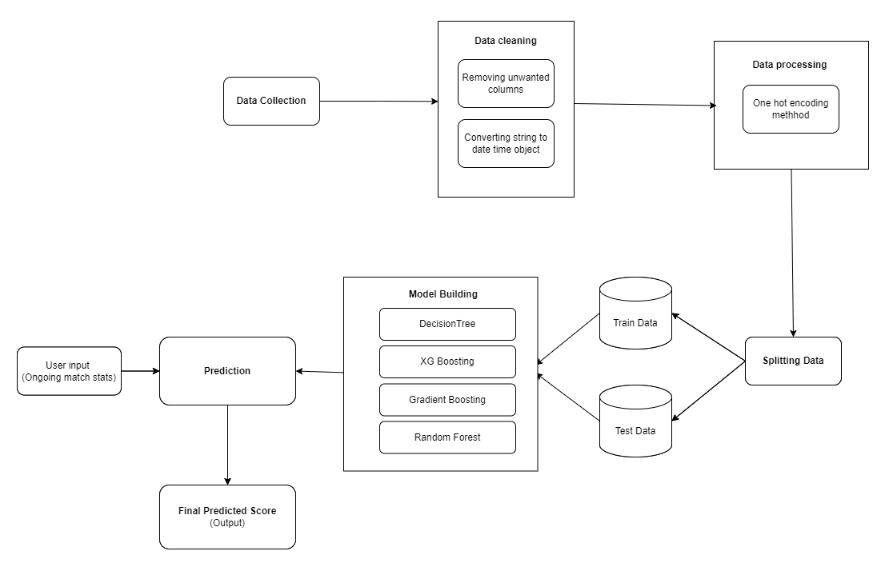

> CHAPTER 3
>
> METHODOLOGY
>
> 3.1 Work Flow
>
> The workflow of Cricket Winner prediction:
>
> Figure 3.1: Overview of Predicting Win Probabilities in BPL Marches
>
> The figure 3.1 represents the workflow for a machine learning model to
> predict a cricket match’s outcome based on ongoing match stats. Here’s
> a detailed breakdown of each step in the process:
>
> 1\. Data Collection: This stage involves gathering historical cricket
> match data. The data could include various match statistics like
> teams, players, runs, wickets, and other relevant details from past
> games.
>
> 2\. Data Cleaning: After collecting the data, the next step is to
> clean it by:
>
> \(a\) Removing unwanted columns:
> Irrelevantorredundantcolumnsaredropped.
>
> 7
>
> 3\. Methodology BPL MATCH WINNER PREDICTION
>
> \(b\) Converting strings to datetime objects: Any string-based date or
> time fields are converted to a proper datetime format for better
> processing.
>
> 3\. Data Processing: In this step, the cleaned data undergoes
> preprocessing to make it suitable for the model. The key technique
> here is:
>
> \(a\) One-hot encoding: Categorical variables (e.g., team names) are
> converted into a format that machine learning algorithms can process,
> typically binary vectors.
>
> 4\. Splitting Data:The processed data is split into two parts:
>
> \(a\) Train Data: Used to train the machine learning models.
>
> \(b\) Test Data: Used to evaluate the model’s performance after
> training.
>
> 5\. Model Building: Multiple machine learning models are trained to
> predict match outcomes, such as:
>
> \(a\) Decision Tree: A tree-based algorithm that makes predictions
> based on fea-ture splits.
>
> \(b\) XGBoosting: An ensemble method based on boosting, used to
> improve pre-diction accuracy.
>
> \(c\) Gradient Boosting: Another boosting method that focuses on
> reducing errors iteratively.
>
> \(d\) Random Forest: An ensemble of decision trees, providing more
> robust pre-dictions.
>
> 6\. Prediction: The trained models are used to predict match outcomes
> in real-time based on user input. The user provides ongoing match
> statistics (e.g., current runs, wickets, overs), which are fed into
> the model to generate predictions.
>
> 7\. Final Predicted Score (Output):The prediction step results in the
> final predicted score or match outcome, which can be the probability
> of a team winning or the projected final score based on current game
> stats.
>
> This workflow represents the pipeline from raw data collection to
> model-driven predictions during a cricket match.
>
> 3.2 Data Collection and Preparation
>
> 1\. Data Sources: Gather comprehensive historical data on BPL matches,
> including season, match number, date, teams, scores, wickets, player
> performances, toss out-comes, venue details, and match results.
>
> 2\. Data Cleaning: Cleanse the dataset by handling missing values,
> inconsistencies, and outliers. Ensure data uniformity and correctness
> across all variables.
>
> 3.3 Feature Selection and Engineering
>
> 1\. Identifying Key Feature: Determine key features from historical
> match data that significantly influence match outcomes, such as team
> strength, player form, head-to-head records, and home advantage.
>
> 2\. Feature Engineering: Create new features that enhance the model’s
> predictive ca-pability, such as derived statistics, recent performance
> trends, and contextual factors (e.g., match venue, pitch type).
>
> 8
>
> 3\. Methodology BPL MATCH WINNER PREDICTION
>
> 3.4 Model Selection and Development
>
> In our model selection process, we evaluated various machine learning
> algorithms, includ-ing XG Boosting, Decision Trees, Random Forests,
> and Gradient Boosting. We compared the performance of these models
> based on metrics such as accuracy, precision, recall, and F1-Score.
> Additionally, we used a confusion matrix for detailed error analysis
> to select the most suitable model for accurately predicting cricket
> match outcomes. After comparison, XG Boosting was found to be more
> accurate than the other algorithms.
>
> 3.4.1 Model : Decision Tree
>
> Why Did We Select This Model ?
>
> The Decision Tree algorithm is a popular choice in supervised learning
> tasks due to its interpret-ability and ability to handle both
> categorical and numerical data. This model is particularly useful for
> classification and regression problems because it breaks down com-plex
> decision-making processes into a simple tree structure. The key
> reasons for selecting the Decision Tree model are:
>
> • Simplicity and Interpret-ability: The Decision Tree is highly
> intuitive and easy to understand. The tree structure allows us to
> visualize the decision-making process, making it easier to explain to
> stakeholders.
>
> • Handles Mixed Data Types: Decision Trees can handle both categorical
> and numerical features, making them versatile in various problem
> domains.
>
> • Non-parametric Nature: Since Decision Trees are non-parametric
> models, they do not assume any underlying distribution of the data,
> which allows them to capture non-linear patterns effectively.
>
> Advantages of Decision Trees
>
> • Easy to Interpret and Explain: The decision-making process in a
> Decision Tree can be visualized, making it easy to explain to
> non-technical users.
>
> • Handles Both Types of Data: Decision Trees can work with both
> categorical and numerical data, which increases their flexibility.
>
> • Requires Minimal Data Preprocessing: Decision Trees do not require
> scaling or normalization of the data, which simplifies preprocessing
> steps.
>
> • Handles Multi-output Problems: Decision Trees can output multiple
> labels for the same set of features if necessary, handling complex
> problems.
>
> • Robust to Outliers: Due to the splitting mechanism, Decision Trees
> can handle outliers to some extent without affecting the model’s
> accuracy.
>
> How Does a Decision Tree Work ?
>
> The Decision Tree works by recursively splitting the dataset into
> smaller and smaller sub-sets based on certain criteria (e.g.,
> Information Gain, Gini Index). The process continues until the data in
> each subset belongs to the same class (for classification) or
> satisfies certain conditions (for regression).
>
> 1\. Root Node: This is the topmost node in the tree, representing the
> best predictor or feature for the classification or regression task.
>
> 9
>
> 3\. Methodology BPL MATCH WINNER
> PREDICTION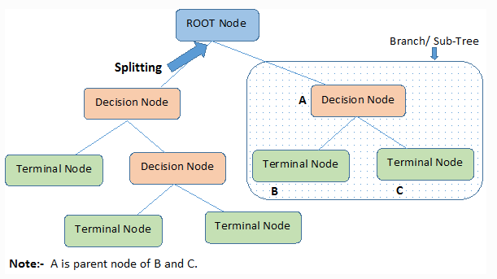 style="width:5.90548in;height:3.31519in" />
>
> 2\. Decision Nodes: Each decision node represents a feature that is
> split based on a specific threshold value.
>
> 3\. Terminal Nodes: The terminal nodes represent the final
> classification or predic-tion. Once a leaf node is reached, no further
> splits occur.
>
> Figure 3.2: Terminology of Decision Trees
>
> The tree is constructed using a recursive algorithm, where at each
> step, the best feature is selected to split the data based on the
> highest Information Gain or lowest Gini Impurity.
>
> 3.4.2 Model : XG Boosting Classifier
>
> Why Select XGBoost ?
>
> XGBoost (Xtreme Gradient Boosting) is a powerful machine learning
> algorithm that has gained widespread use due to its high performance
> and computational eficiency. The reasons for choosing XGBoost for our
> model are:
>
> • Execution Speed: XGBoost is optimized for speed and works
> exceptionally well with large datasets. It is engineered for high
> computational eficiency, reducing training time compared to other
> algorithms such as Random Forest (RF) or Gradient Boosting Machines
> (GBM).
>
> • Model Performance: XGBoost consistently outperforms many machine
> learning algorithms, including decision trees, random forests, and
> GBM, due to its advanced tree boosting methods and regularization
> capabilities. This results in a lower bias-variance tradeoff.
>
> • Automatic Regularization: XGBoost uses both L1 (Lasso) and L2
> (Ridge) reg-ularization techniques, which prevent the model from
> overfitting.
>
> • No Hyperparameter Tuning Required: XGBoost can be used with its
> default settings and still provide robust performance without the need
> for extensive hyper-parameter tuning, making it highly eficient for
> both beginners and experts.
>
> 10
>
> 3\. Methodology BPL MATCH WINNER
> PREDICTION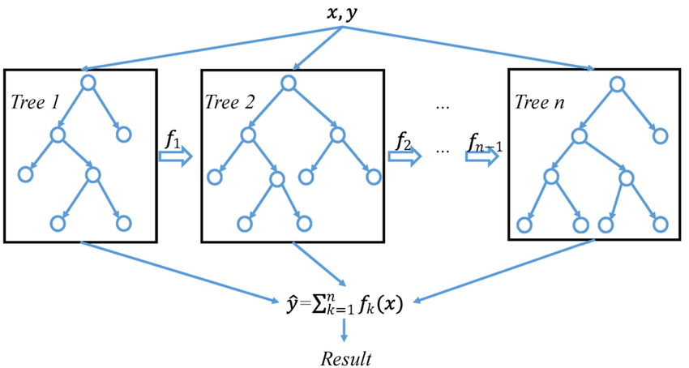
>
> How XGBoost Works ?
>
> XGBoost is a decision-tree-based ensemble algorithm that uses boosting
> techniques to improve model accuracy. Boosting is an ensemble
> technique that sequentially trains weak models, typically decision
> trees, and combines their predictions to build a strong model.
>
> The key idea behind XGBoost is to minimize the loss function using
> gradient descent, where each new tree attempts to correct the errors
> made by the previous trees. The model is trained iteratively, and at
> each iteration, it focuses on minimizing the residual errors of the
> previous iteration.
>
> Figure 3.3: A general architecture of XGBoost
>
> Advantages of XGBoost
>
> • Handling Missing Data: XGBoost automatically handles missing data by
> assign-ing them to the optimal split during training.
>
> • Tree Pruning: XGBoost uses a technique called max-depth pruning to
> stop the growing of trees when no improvement is observed, which leads
> to faster and more eficient models.
>
> • Built-in Regularization: XGBoost has L1 and L2 regularization, which
> helps in avoiding overfitting, making it more generalizable.
>
> • Parallel Processing: XGBoost can leverage multiple cores during
> training, result-ing in faster computations.
>
> 3.4.3 Model : Gradient Boosting Classifier
>
> Why Gradient Boosting Classifier ?
>
> Gradient Boosting is a powerful ensemble learning technique that
> builds models sequen-tially, with each new model attempting to correct
> the errors of the previous ones. This model is chosen due to its
> capability to handle complex datasets with high variance and bias. It
> excels in both classification and regression tasks, making it suitable
> for predictive tasks like cricket match outcome prediction. The model
> also effectively reduces overfitting through boosting, making it
> robust for training on moderately sized datasets.
>
> 11
>
> 3\. Methodology BPL MATCH WINNER
> PREDICTION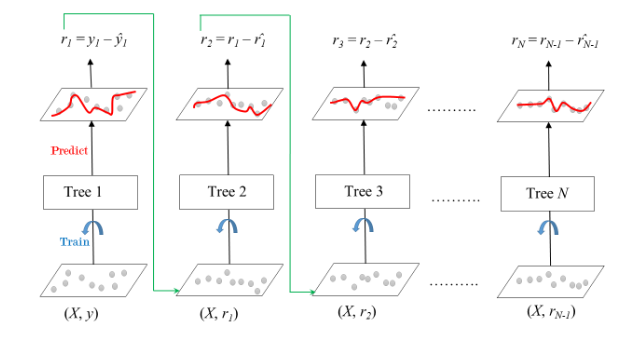 style="width:5.51204in;height:3.01063in" />
>
> Advantages of Gradient Boosting:
>
> • Reduction of Bias: By focusing on the errors made by previous
> models, Gradient Boosting reduces the overall bias.
>
> • Handling Non-linear Relationships: Gradient Boosting can capture
> complex, non-linear relationships between features.
>
> • Flexibility: It can be applied to both classification and regression
> problems.
>
> • Customizable Loss Functions: It allows the use of different loss
> functions based on the problem’s needs.
>
> • Feature Importance: Provides feature importance, aiding in feature
> selection for optimizing the model.
>
> How Gradient Boosting Works ?
>
> Gradient Boosting works by combining weak learners, typically decision
> trees, to form a strong predictive model. Each subsequent tree is
> fitted on the residual errors (or gradi-ents) of the previous tree’s
> predictions. The model minimizes the loss function using a gradient
> descent algorithm, making small adjustments to the predictions in the
> direction that reduces the error.
>
> Figure 3.4: Working Diagram of Gradient Boosting Algorithm
>
> 3.4.4 Model : Random Forest Classifier
>
> A supervised learning approach that may be applied to regression and
> classification prob-lems is called Random Forest. In order to produce
> the class that is the mean prediction for regression tasks or the mode
> of classifications for classification tasks, it builds numerous
> decision trees during the training phase. This ensemble strategy of
> mixing many deci-sion trees is where the name ”Random Forest” comes
> from. By averaging the predictions from numerous trees, the model
> lowers the possibility of overfitting and achieves excellent accuracy.
>
> 12
>
> 3\. Methodology BPL MATCH WINNER
> PREDICTION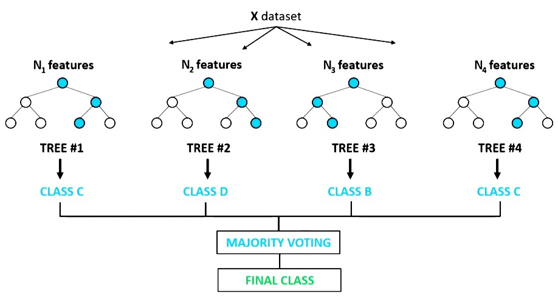 style="width:5.51182in;height:2.95405in" />
>
> Why Select Random Forest ?
>
> The Random Forest classifier is selected due to its flexibility,
> robustness, and ability to handle high-dimensional datasets. It works
> well on both large and small datasets and can manage missing values
> effectively. Moreover, it provides feature importance, which is
> helpful in feature selection and understanding the significance of
> different variables.
>
> Advantages
>
> • Highly accurate and robust because it aggregates the predictions
> from multiple trees.
>
> • It mitigates overfitting, especially when trained with a large
> number of trees.
>
> • It can automatically rank feature importance, which is useful for
> feature selection.
>
> How Random Forest Works ?
>
> The Random Forest algorithm can be summarized in two stages: Stage 1:
> Build a Forest
>
> 1\. Randomly select k features from the total m features, where k \<
> m.
>
> 2\. Among these k features, calculate the best split point at a node.
>
> 3\. Split the node into daughter nodes.
>
> 4\. Repeat this process until a specified number of nodes, l, are
> reached.
>
> 5\. Repeat steps 1-4 to build n decision trees. Stage 2: Make
> Predictions
>
> Figure 3.5: Working procedure of Random Forest
>
> 1\. Use the test data and apply each decision tree’s rules to predict
> the outcome.
>
> 2\. Calculate the votes for each predicted outcome from all the trees.
>
> 3\. The class with the highest votes is chosen as the final
> prediction.
>
> Finally, we implement our dataset using these four models.
>
> 13
>
> CHAPTER 4
>
> IMPLEMENTATION
>
> 4.1 System Requirements
>
> 4.1.1 Operating System
>
> The project can be developed and executed on any major operating
> system, including:
>
> • Windows
>
> • Linux
>
> • macOS
>
> The choice of the operating system does not significantly impact the
> project’s performance, as Python is platform-independent, but Linux is
> often preferred for its compatibility with scientific and machine
> learning tools.
>
> 4.1.2 Integrated Development Environment (IDE)
>
> An Integrated Development Environment (IDE) streamlines the
> development process by providing useful features such as syntax
> highlighting, code completion, debugging tools, and integrated version
> control. The following IDEs are suitable for this project:
>
> • PyCharm
>
> • Jupyter Notebook
>
> • VS Code (Visual Studio Code)
>
> • Spyder
>
> Using these IDEs enhances productivity and simplifies the development
> and debugging of machine learning models, making them an essential
> component of the project workflow.
>
> 4.1.3 Language and Libraries
>
> The project is implemented in Python, a versatile and widely-used
> programming language known for its robust libraries and tools that are
> particularly suited for data analysis, ma-chine learning, and
> statistical modeling. The following libraries were utilized to
> facilitate various aspects of the project:
>
> 14
>
> 4\. Implementation BPL MATCH WINNER PREDICTION
>
> • pandas: Used for data manipulation and analysis, providing data
> structures and functions needed to work eficiently with structured
> data.
>
> • seaborn: A statistical data visualization library based on
> Matplotlib, used for cre-ating informative and attractive graphics.
>
> • matplotlib.pyplot: A plotting library for creating static, animated,
> and interactive visualizations in Python.
>
> • sklearn.preprocessing: LabelEncoder: Used for encoding categorical
> variables into numerical formats suitable for machine learning models.
>
> • sklearn.model selection: train test split: Utilized to split the
> dataset into training and testing sets for model evaluation.
>
> • sklearn.tree: DecisionTreeClassifier: A decision tree algorithm used
> for clas-sification tasks within the project.
>
> • sklearn.metrics: accuracy score, confusion matrix, classification
> report: Metrics used for evaluating the performance of the machine
> learning models.
>
> • XGBClassifier: An optimized gradient boosting algorithm, used for
> eficient and scalable implementation of gradient boosting machines.
>
> • GradientBoostingClassifier: Another gradient boosting model used for
> classifi-cation tasks, known for its ability to improve accuracy by
> reducing overfitting.
>
> • RandomForestClassifier: An ensemble learning method that operates by
> con-structing multiple decision trees during training and outputting
> the mode of the classes for classification.
>
> These libraries collectively provide the tools necessary to perform
> data preprocessing, model training, and evaluation, making them
> integral to the success of the project.
>
> 4.2 Dataset Description
>
> This dataset \[6\] consists of 435 entries (rows) and 20 columns, each
> representing various aspects of a cricket match, such as team
> performance, match outcomes, and match-specific details.
>
> 4.2.1 Data Types
>
> • The dataset contains 6 columns of integer type int64 related to
> scores, wickets, and match outcomes.
>
> • The remaining 14 columns are of object type object, capturing
> categorical data like team names, player names, venues, etc.
>
> 4.2.2 Data Size
>
> • The dataset consists of 435 non-null entries in each column,
> ensuring no missing data.
>
> • The total memory usage is approximately 58.1 KB, making it
> relatively lightweight and manageable for data analysis
>
> 15
>
> 4\. Implementation BPL MATCH WINNER
> PREDICTION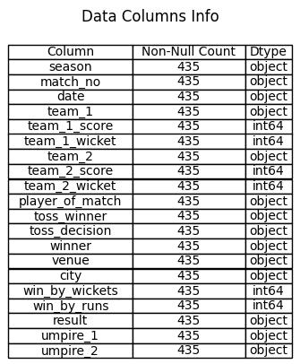 style="width:2.36225in;height:2.86291in" />
>
> 4.3 Mapping
>
> In this project, we encountered several instances where different
> franchise teams from the same city had varying names across different
> seasons. To maintain consistency and simplify the analysis, we
> implemented a mapping function to standardize team names based on
> their corresponding cities.
>
> The mapping dictionary is defined as follows:
>
> team_mapping = {
>
> ’Comilla Victorians’: ’Comilla’, ’Cumilla Warriors’: ’Comilla’,
> ’Rangpur Riders’: ’Rangpur’, ’Rangpur Rangers’: ’Rangpur’, ’Dhaka
> Dynamites’: ’Dhaka’, ’Dhaka Dominators’: ’Dhaka’, ’Dhaka Gladiators’:
> ’Dhaka’, ’Durdanto Dhaka’: ’Dhaka’, ’Dhaka Platoon’: ’Dhaka’,
> ’Minister Group Dhaka’: ’Dhaka’,
>
> ’Chittagong Vikings’: ’Chattogram’, ’Chittagong Kings’: ’Chattogram’,
> ’Chattogram Challengers’: ’Chattogram’, ’Barishal Bulls’: ’Barishal’,
>
> ’Barisal Bulls’: ’Barishal’, ’Barisal Burners’: ’Barishal’, ’Fortune
> Barishal’: ’Barishal’, ’Rajshahi Kings’: ’Rajshahi’, ’Duronto
> Rajshahi’: ’Rajshahi’, ’Rajshahi Royals’: ’Rajshahi’, ’Khulna Titans’:
> ’Khulna’, ’Khulna Royal Bengals’: ’Khulna’, ’Khulna Tigers’: ’Khulna’,
> ’Sylhet Sixers’: ’Sylhet’, ’Sylhet Royals’: ’Sylhet’, ’Sylhet
> Strikers’: ’Sylhet’,
>
> 16
>
> 4\. Implementation BPL MATCH WINNER PREDICTION
>
> ’Sylhet Sunrisers’: ’Sylhet’, ’Sylhet Thunder’: ’Sylhet’, ’Sylhet
> Super Stars’: ’Sylhet’
>
> }
>
> The function replace team name() was created to replace the franchise
> names with their corresponding city names as per the mapping. This
> function is applied to the team 1, team 2, winner, and toss winner
> columns in the dataset to ensure uniformity in the team names:
>
> def replace_team_name(team_name):
>
> return team_mapping.get(team_name, team_name)
>
> bpl\[’team_1’\] = bpl\[’team_1’\].apply(replace_team_name)
> bpl\[’team_2’\] = bpl\[’team_2’\].apply(replace_team_name)
> bpl\[’winner’\] = bpl\[’winner’\].apply(replace_team_name)
> bpl\[’toss_winner’\] = bpl\[’toss_winner’\].apply(replace_team_name)
>
> As a result, the dataset now reflects a consistent naming convention
> for teams, based on their respective cities. This standardization was
> essential for accurate data analysis, allowing us to focus on
> city-based team performance without the noise of varying franchise
> names.
>
> The output after applying the mapping is shown in Table 4.1.

||
||
||
||
||
||
||
||
||
||
||

> Table 4.1: Sample Output After Applying Team Name Mapping
>
> Finally, After Mapping we see The Number of BPL matches won by each
> team, grouped by season shown in Figure 4.1
>
> 4.4 Data Preprocessing
>
> In this section, we outline the steps taken to preprocess the data for
> the subsequent analysis. The following columns were selected for
> analysis shown in Table 4.2
>
> The first step of preprocessing involves identifying the unique or
> distinct values in each of these columns to gain an understanding of
> the variety present in the dataset. This provides insights into the
> categorical and numerical data distributions, which can later inform
> further cleaning, encoding, and transformations.
>
> The following preprocessing steps will be performed:
>
> 1\. Checking for missing values in the selected columns.
>
> 2\. Identifying and handling duplicate entries.
>
> 3\. Standardizing categorical variables where necessary (e.g., venue,
> city, toss ~~d~~ecision).
>
> 17
>
> 4\. Implementation BPL MATCH WINNER
> PREDICTION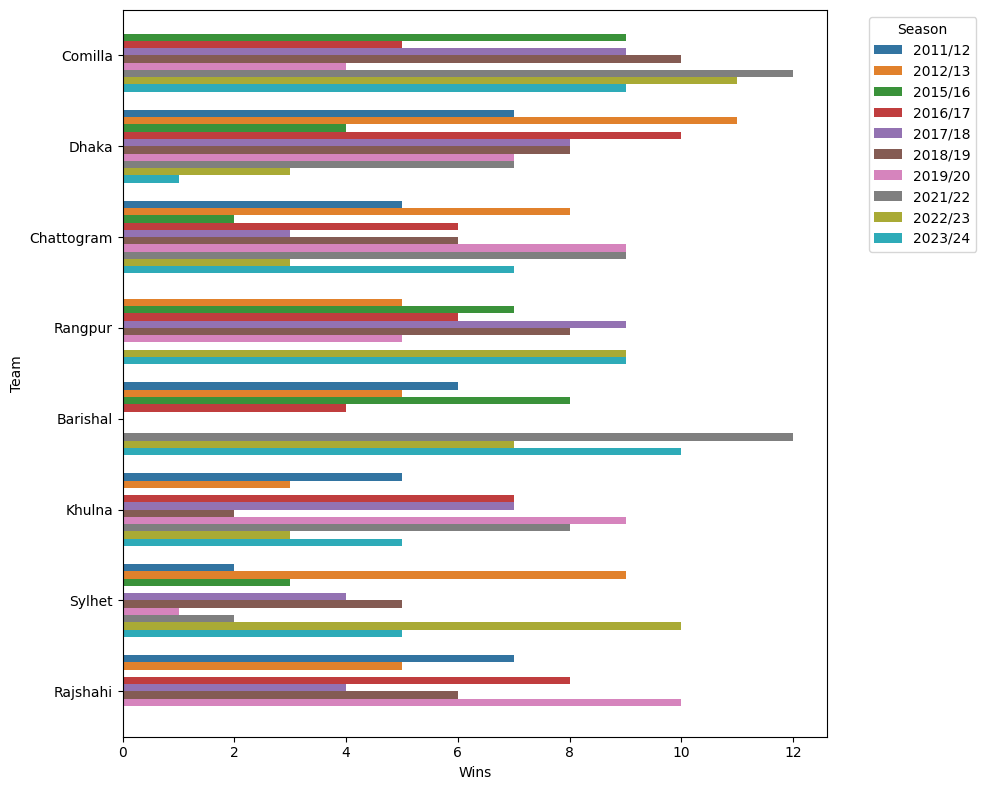 style="width:5.51194in;height:4.41626in" />
>
> Figure 4.1: Number of BPL matches won by each team, grouped by season

||
||
||
||
||
||
||
||

> Table 4.2: Sample of Unique Values for Different Category
>
> 4\. Normalizing numerical variables such as scores and wickets.
>
> This initial preprocessing ensures the dataset is clean, standardized,
> and ready for subsequent stages of analysis, such as model training or
> statistical evaluation.
>
> 4.5 Label Encoding
>
> Label encoding is a method used to convert categorical variables into
> numerical values, which is crucial for machine learning models that
> require numerical input. This technique assigns a unique integer to
> each category, allowing the model to process and learn from
>
> 18
>
> 4\. Implementation BPL MATCH WINNER
> PREDICTION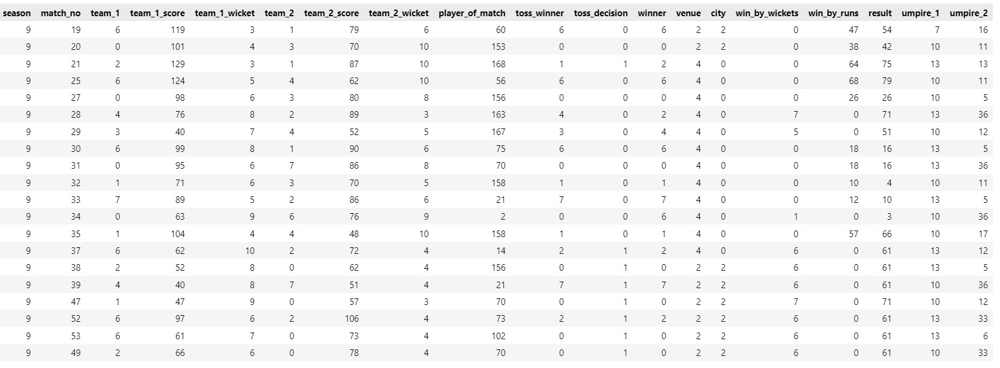 style="width:5.90566in;height:2.17428in" />
>
> categorical data.
>
> In our analysis, we used label encoding to transform various
> categorical columns into integer representations. This process is
> essential for preparing the dataset for machine learning classifiers,
> which can then learn from the numeric data Shown in Figure 4.2.
>
> Figure 4.2: Sample of Data after Label Encoding
>
> The following table illustrates a portion of the dataset after label
> encoding has been applied. Each categorical column has been converted
> into numerical values, which are now suitable for use in machine
> learning algorithms.
>
> 4.6 Model Application
>
> After the processing of data it’s ready for applying machine learning
> models. We focus on selecting the relevant columns as features and
> defining the target variable for training the model.
>
> The dataset contains various features that represent match
> information, such as team performance, venue, and umpires, and these
> features will be used to predict the outcome of the match,
> specifically the winner. The features and target are defined as
> follows:
>
> • Feature Matrix (X): The feature matrix consists of the following
> columns:
>
> X = dataframe\[’season’, ’team_1’, ’team_1_score’, ’team_1_wicket’,
> ’team_2’, ’toss_winner’, ’toss_decision’,’venue’, ’city’, ’umpire_1’,
> ’umpire_2’\]
>
> • Target Variable (y): The target variable for our model is the winner
> column, which indicates the team that won the match.
>
> Y = dataframe\[’winner’\]
>
> The feature matrix (X) contains all the information that may influence
> the outcome of the match, while the target variable (y) represents the
> actual result that we aim to predict. These variables are used to
> train and evaluate machine learning classifiers that will predict the
> winner of a match based on the input features. In the next steps, we
> will apply various machine learning classifiers to predict the match
> winner based on the defined features.
>
> 19
>
> 4\. Implementation BPL MATCH WINNER PREDICTION
>
> 4.6.1 Decision Tree : Model Training & Testing
>
> Formula
>
> The splitting of nodes in Decision Trees is often determined using
> criteria like Gini Im-purity or Information Gain. The formulas for
> these metrics are as follows:
>
> Gini Impurity The Gini Impurity is used to measure the degree of
> impurity in a node. It is calculated as:
>
> X Gini = 1− pi
>
> i=1 Where:
>
> • pi is the proportion of samples belonging to class i in the node.
>
> Information Gain (Entropy)
>
> The Information Gain is based on the concept of entropy and measures
> how well a partic-ular feature separates the classes. It is calculated
> as:
>
> n
>
> Entropy = − pi log2(pi) i=1
>
> Where:
>
> • pi is the probability of class i in the node.
>
> The Information Gain is the reduction in entropy after a dataset is
> split on a par-ticular feature:
>
> X Information Gain = Entropyparent − Entropyi
>
> i=1 Where:
>
> • Entropyparent is the entropy of the dataset before the split.
>
> • ni is the number of samples in child node i, and n is the total
> number of samples.
>
> • Entropyi is the entropy of the child node i.
>
> These criteria guide the Decision Tree in selecting the best features
> to split the data at each step, resulting in a tree that models the
> underlying data distribution effectively.
>
> Code Implementation & Explanation
>
> The following steps outline the implementation of the Decision Tree
> Classifier model, including splitting the data, training the model,
> and making predictions.
>
> 20
>
> 4\. Implementation BPL MATCH WINNER PREDICTION
>
> Step 1: Splitting the Data into Training and Test Sets : First, we
> split the dataset into training and test sets using the train test
> split function. This function ensures that 80% of the data is used for
> training, while the remaining 20% is reserved for testing. We also set
> the random state parameter to ensure reproducibility of results.
>
> \# Split the data into training and test sets
>
> X_train, X_test, y_train, y_test = train_test_split(X, y,
> test_size=0.2, random_state=4)
>
> • X: The feature matrix containing the independent variables.
>
> • y: The target vector containing the dependent variable (i.e.,
> labels).
>
> • test size=0.2: 20% of the data is reserved for testing.
>
> • random state=4: Ensures that the results are reproducible.
>
> Step 2: Initializing the Decision Tree Classifier Model : Next, we
> initialize the Decision Tree Classifier model by creating an instance
> of the DecisionTreeClassifier class. We set random state=1 to ensure
> consistent results across different runs.
>
> \# Initialize the Decision Tree Classifier model model =
> DecisionTreeClassifier(random_state=1)
>
> • random state=1: Ensures reproducibility of the tree structure.
>
> Step 3: Training the Model : The Decision Tree Classifier model is
> then trained on the training dataset using the fit method. This method
> takes the independent variables (X train) and the target labels (y
> train) as input.
>
> \# Train the model model.fit(X_train, y_train)
>
> • X train: The training feature matrix.
>
> • y train: The target vector corresponding to the training data.
>
> Step 4: Making Predictions on the Test Set : Once the model is
> trained, we use it to make predictions on the test dataset by calling
> the predict method. This method generates predictions for the
> independent variables in X test.
>
> \# Make predictions on the test set y_pred = model.predict(X_test)
>
> • X test: The test feature matrix.
>
> • y pred: The predicted labels for the test data.
>
> The above steps provide the basic framework for training and testing a
> Decision Tree Classifier model. Once the predictions are made, various
> evaluation metrics such as accu-racy, confusion matrix, and
> classification report can be used to assess the model’s perfor-mance.
>
> 21
>
> 4\. Implementation BPL MATCH WINNER PREDICTION
>
> 4.6.2 XG Boosting Classifier : Model Training & Testing
>
> Formula
>
> Objective Function The objective function of XGBoost combines the loss
> function with a regularization term:
>
> X X
>
> L(θ) = ℓ(yi,yˆ )+ Ω(fk)
>
> i=1 k=1 Where:
>
> • ℓ(yi,yˆ ) is the loss function that measures the difference between
> the true label yi and the predicted label yˆ .
>
> • Ω(fk) is the regularization term that controls the complexity of the
> model and helps prevent overfitting.
>
> • fk represents the individual trees in the ensemble.
>
> Gradient Descent In each iteration of boosting, XGBoost computes the
> gradient of the loss function with respect to the current model’s
> predictions and uses these gradients to update the model. This allows
> XGBoost to focus on minimizing the prediction errors of the previous
> models.
>
> ∂ℓ(yi,yˆ ) i ∂yˆ
>
> ∂2ℓ(yi,yˆ ) i ∂yˆ2
>
> Here, gi and hi are the first and second-order gradients,
> respectively, which are used to improve the model at each boosting
> step.
>
> Code Implementation
>
> The following steps demonstrate how to implement XGBoost for training
> and testing a classification model in Python using the XGBClassifier
> from the xgboost library:
>
> \# Split the data into training and test sets
>
> X_train, X_test, y_train, y_test = train_test_split(X, y,
> test_size=0.2, random_state=3)
>
> \# Initialize the XGBoost model
>
> model = XGBClassifier(eval_metric=’mlogloss’)
>
> \# Train the model model.fit(X_train, y_train)
>
> \# Make predictions on the test set y_pred = model.predict(X_test)
>
> 22
>
> 4\. Implementation BPL MATCH WINNER PREDICTION
>
> Explanation
>
> • train test split: Splits the dataset into training (80%) and testing
> (20%) sets, with a fixed random state for reproducibility.
>
> • XGBClassifier: Initializes the XGBoost classifier with mlogloss
> (multiclass loga-rithmic loss) as the evaluation metric. This metric
> is suitable for multi-class classi-fication problems.
>
> • fit: Trains the XGBoost model on the training data (X train and y
> train).
>
> • predict: Predicts the target variable for the test set (X test)
> based on the trained model.
>
> After the predictions (y pred) are made, you can evaluate the model’s
> performance using various metrics such as accuracy, precision, recall,
> and F1-score, or visualize the confusion matrix for a more detailed
> evaluation.
>
> So, The model can now be evaluated using various metrics such as
> accuracy, preci-sion, recall, and F1-score. XGBoost’s ability to
> handle large datasets and improve model performance through boosting
> makes it an ideal choice for many classification problems.
>
> 4.6.3 Gradient Boosting Classifier : Model Training & Testing
>
> Formula
>
> Gradient Boosting minimizes a differentiable loss function L(y,F(x))
> where F(x) is the model’s predicted output and y is the true label.
> The update rule for the model at each iteration m is:
>
> Fm(x) = Fm−1(x)+η ·γm ·hm(x)
>
> where:
>
> • Fm−1(x) is the model prediction at the previous step,
>
> • η is the learning rate,
>
> • γm is the optimal weight for the m-th weak learner (determined by
> minimizing the loss function),
>
> • hm(x) is the m-th weak learner (usually a decision tree).
>
> The model aims to iteratively add weak learners that improve its
> prediction by reducing the gradient of the loss function.
>
> Code Implementation
>
> To implement the Gradient Boosting Classifier in Python, we can use
> the GradientBoost-ingClassifier class from sklearn.ensemble. Below is
> the step-by-step implementation:
>
> \# Split the data into training and test sets X_train, X_test,
> y_train, y_test =
>
> train_test_split(X, y, test_size=0.1, random_state=5)
>
> \# Initialize the Gradient Boosting model model =
> GradientBoostingClassifier()
>
> \# Train the model
>
> 23
>
> 4\. Implementation BPL MATCH WINNER PREDICTION
>
> model.fit(X_train, y_train)
>
> \# Make predictions on the test set y_pred = model.predict(X_test)
>
> Explanation
>
> • We split the dataset into training and test sets using train test
> split() to evaluate the model’s performance on unseen data.
>
> • The GradientBoostingClassifier is initialized without any
> parameters, meaning default values are used.
>
> • After training the model using the fit() method, predictions are
> made on the test set using predict().
>
> • The model’s accuracy is computed using accuracy score(), which can
> be used to measure performance.
>
> 4.6.4 Random Forest Classifier : Model Training & Testing
>
> Formula
>
> The formula for Random Forest combines the outputs from all the trees
> to make the final prediction:
>
> yˆ = majority vote(h1(x),h2(x),...,hn(x)) Where:
>
> • yˆ is the predicted class.
>
> • h1(x),h2(x),...,hn(x) are the individual predictions from each
> decision tree in the forest.
>
> • The majority vote is taken to select the final class. 3.5
>
> Code Implementation
>
> The implementation of a Random Forest classifier using the
> RandomForestClassifier from scikit-learn is straightforward. Follow
> these steps:
>
> \# Import necessary libraries
>
> from sklearn.model_selection import train_test_split from
> sklearn.ensemble import RandomForestClassifier
>
> from sklearn.metrics import accuracy_score, confusion_matrix,
> classification_report
>
> \# Split the data into training and test sets
>
> X_train, X_test, y_train, y_test = train_test_split(X, y,
> test_size=0.2, random_state=5)
>
> \# Initialize the Random Forest model
>
> model = RandomForestClassifier(n_estimators=100, random_state=0)
>
> 24
>
> 4\. Implementation BPL MATCH WINNER PREDICTION
>
> \# Train the model model.fit(X_train, y_train)
>
> \# Make predictions on the test set y_pred = model.predict(X_test)
>
> \# Evaluate the model performance
>
> accuracy = accuracy_score(y_test, y_pred) conf_matrix =
> confusion_matrix(y_test, y_pred) report =
> classification_report(y_test, y_pred)
>
> Explanation
>
> The following Python code implements a Random Forest Classifier to
> predict outcomes based on the provided dataset. Here, we explain each
> section of the code in detail.
>
> Step 1: Importing Necessary Libraries : We first import the required
> libraries to split the dataset, create the random forest model, and
> evaluate its performance.
>
> from sklearn.model_selection import train_test_split from
> sklearn.ensemble import RandomForestClassifier
>
> from sklearn.metrics import accuracy_score, confusion_matrix,
> classification_report
>
> • train test split: This function is used to split the dataset into
> training and testing sets.
>
> • RandomForestClassifier: This class is used to instantiate the Random
> Forest classifier model.
>
> • accuracy score, confusion matrix, classification report: These
> functions are used to evaluate the model’s performance.
>
> Step 2: Splitting the Data : Next, we split the dataset into training
> and test sets using the train test split function.
>
> X_train, X_test, y_train, y_test = train_test_split(X, y,
> test_size=0.2, random_state=5)
>
> • X: Feature set (input variables).
>
> • y: Target variable (output or label).
>
> • test size=0.2: 20% of the data is reserved for testing.
>
> • random state=5: Ensures reproducibility by setting a seed for
> randomization.
>
> Step 3: Initializing the Random Forest Mode : We then initialize the
> Random Forest model with the following parameters:
>
> model = RandomForestClassifier(n_estimators=100, random_state=0)
>
> • n estimators=100: Specifies the number of trees in the forest (100
> trees).
>
> • random state=0: Ensures reproducibility of the model by setting a
> seed for random processes.
>
> 25
>
> 4\. Implementation
>
> Step 4: Training the Mode :
>
> BPL MATCH WINNER PREDICTION

The model is trained using the training data:

> model.fit(X_train, y_train)
>
> Here, X train represents the input features for training, and y train
> represents the labels.
>
> Step 5: Making Predictions : Once the model is trained, we use it to
> make predictions on the test set:
>
> y_pred = model.predict(X_test)
>
> y pred contains the predicted labels for the test data.
>
> 26
>
> CHAPTER 5
>
> RESULT ANALYSIS
>
> 5.1 Performance Evaluation
>
> In this section, we analyze and evaluate the performance of various
> machine learning mod-els applied to the dataset. The models chosen for
> evaluation include XGBoost, Decision Tree, Gradient Boosting, and
> Random Forest classifiers. Each of these models leverages different
> techniques to classify the data and predict outcomes with varying
> levels of ac-curacy and interpretability. By comparing these models,
> we aim to understand their strengths, weaknesses, and suitability for
> this problem domain. The performance of these models is measured using
> key metrics such as accuracy, precision, recall, F1-score, and
> confusion matrix.
>
> 5.1.1 Decision Tree Performance
>
> The Decision Tree classifier achieved an overall accuracy of 94.25%.
> The detailed classi-fication report provides insights into the model’s
> precision, recall, and F1-score for each class, as shown below.
>
> 0 1 2 3 4 5 6 7
>
> accuracy macro avg weighted avg

Precision Recall

> 0.92 1.00 1.00 0.93 0.94 0.94 1.00 0.92 1.00 0.90 0.75 1.00 0.90 1.00
> 1.00 0.88
>
> 0.94 0.95 0.95 0.94

F1-score

> 0.96 0.97 0.94 0.96 0.95 0.86 0.95 0.93
>
> 0.94 0.94 0.94

Support

> 11 15 16 12 10 6 9 8
>
> 87 87 87
>
> Table 5.1: Decision Tree Classification Report
>
> The overall accuracy of the model is 94.25%, indicating that the
> Decision Tree classifier performs well on this dataset. The weighted
> average precision, recall, and F1-score are all
>
> 27
>
> 5\. Result Analysis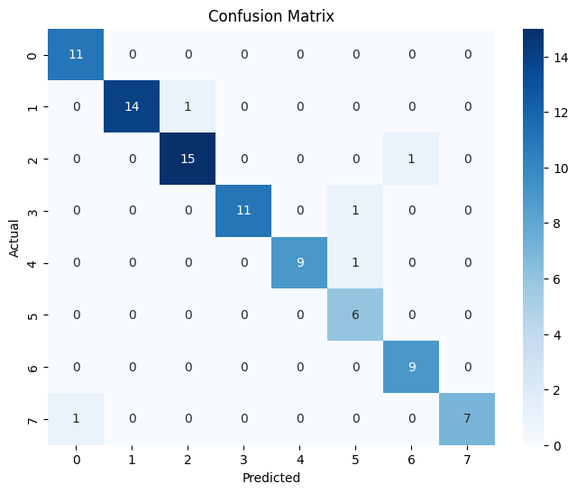 style="width:2.24416in;height:1.91806in" />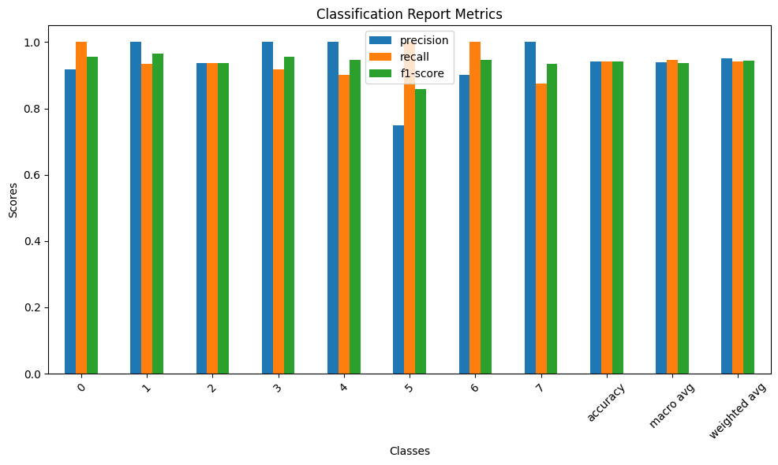 style="width:3.0709in;height:1.83755in" />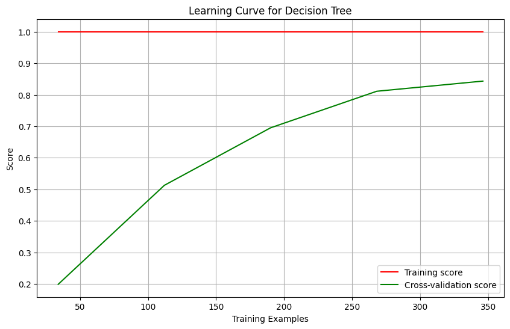 style="width:2.83469in;height:1.83283in" />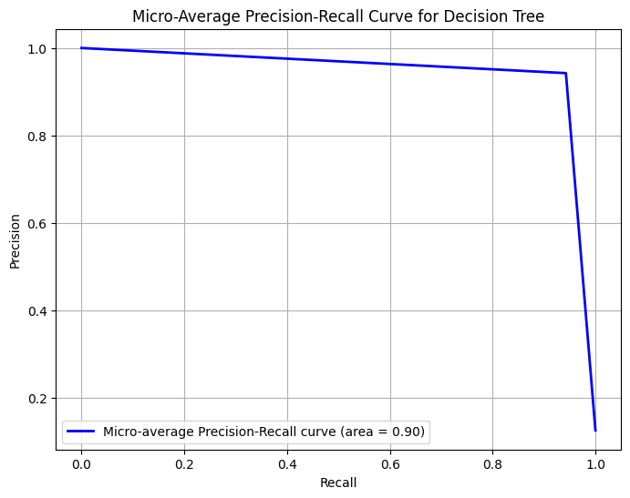 style="width:2.48034in;height:1.96346in" />
>
> Figure 5.1: Decision Tree Confu-sion Matrix
>
> BPL MATCH WINNER PREDICTION

Figure 5.2: Decision Tree Classification Report

> Figure 5.3: Decision Tree learning curve Figure 5.4: Decision Tree
> precision re-call curve
>
> approximately 0.94, demonstrating the model’s robustness in handling
> different classes. The macro average F1-score of 0.94 further
> highlights the balanced performance across classes.
>
> 5.1.2 XGBoost Performance
>
> The XGBoost classifier achieved an overall accuracy of 97.70%. The
> comprehensive classifi-cation report, presented in Table 5.2,
> indicates outstanding recall, precision, and F1-scores for each class,
> demonstrating the model’s high effectiveness in making predictions.
>
> The learning curve in Figure 5.5 shows that the XGBoost model’s
> performance im-proves consistently with the increasing size of the
> training set. This suggests that the model effectively learns from
> more data, resulting in better predictions as more training examples
> are provided.
>
> Figure 5.6 illustrates the precision-recall curves for the XGBoost
> classifier. The curves demonstrate high precision and recall values
> across all classes, reflecting the model’s strong capability in
> accurately classifying instances and effectively handling different
> class dis-tributions. These curves highlight the robustness of XGBoost
> in distinguishing between classes, making it a highly reliable choice
> for this classification task.
>
> 28
>
> 5\. Result Analysis BPL MATCH WINNER
> PREDICTION style="width:2.48034in;height:1.96346in" />
>
> 0 1 2 3 4 5 6 7
>
> accuracy macro avg weighted avg

Precision Recall

> 0.90 0.90 1.00 1.00 1.00 0.93 1.00 1.00 1.00 1.00 1.00 1.00 1.00 1.00
> 0.89 1.00
>
> 0.97 0.98 0.98 0.98

F1-score

> 0.90 1.00 0.97 1.00 1.00 1.00 1.00 0.94
>
> 0.98 0.98 0.98

Support

> 10 10 15 14 12 7 11 8
>
> 87 87 87
>
> Table 5.2: XGBoost Classification Report
>
> 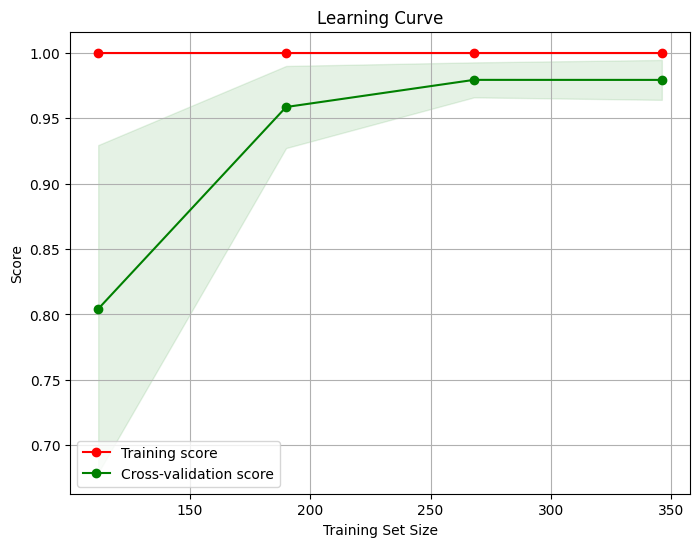 style="width:2.83465in;height:2.21508in" />Figure 5.6: XGBoost
> precision-recall Figure 5.5: XGBoost Learning Curve curves
>
> 5.1.3 Random Forest Performance
>
> The Random Forest classifier achieved an overall accuracy of 89.65%.
> The detailed clas-sification report is summarized in the table 5.3
> below, showing the precision, recall, and F1-scores for each class.
> The model performed quite well, particularly in terms of precision and
> recall, and achieved high F1-scores across most classes.
>
> The Precision-Recall Curves for the Random Forest classifier, shown in
> Figure 5.7, indicates that the model correctly classified most of the
> instances, although a few mis-classifications occurred, particularly
> between class 6 and other classes. Despite this, the model has an
> overall good classification performance.
>
> The learning curve in Figure 5.8 shows that the model performs
> consistently well as the training size increases, indicating that the
> Random Forest classifier is well-suited for this dataset and capable
> of achieving high accuracy with suficient data. Additionally, the
> precision-recall curves in Figure 5.7 demonstrate strong precision and
> recall values across the different classes, further highlighting the
> robustness of the model.
>
> 29
>
> 5\. Result Analysis BPL MATCH WINNER PREDICTION
>
> 0 1 2 3 4 5 6 7
>
> accuracy macro avg weighted avg

Precision Recall

> 0.88 1.00 1.00 1.00 0.82 1.00 1.00 0.83 0.86 1.00 0.86 0.86 0.80 0.86
> 1.00 0.73
>
> 0.90 0.91 0.91 0.90

F1-score

> 0.93 1.00 0.90 0.91 0.92 0.86 0.83 0.84
>
> 0.90 0.90 0.90

Support

> 7 10 14 18 6 7 14 11
>
> 87 87 87
>
> 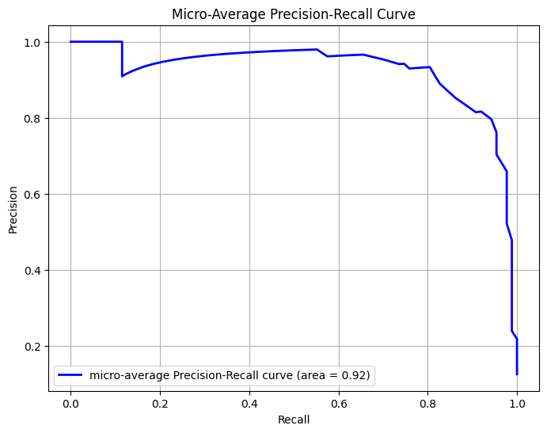 style="width:2.36211in;height:1.86986in" />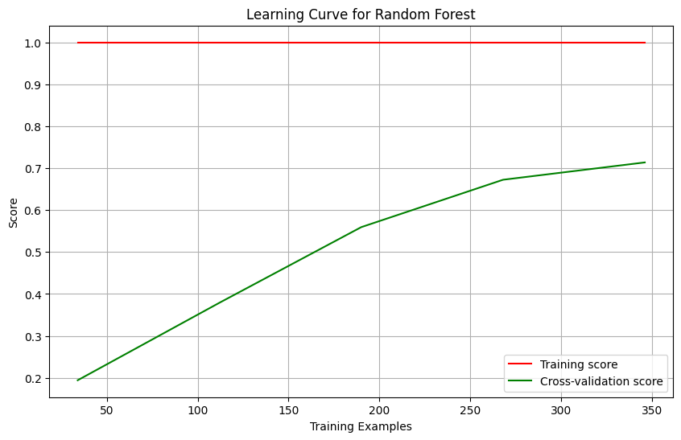 style="width:2.95279in;height:1.90919in" />Table 5.3: Random Forest
> Classification Report
>
> Figure 5.7: Random Forest Precision-Recall Curves

Figure 5.8: Random Forest Learning Curve

> 5.1.4 Gradient Boosting Performance
>
> The Gradient Boosting classifier achieved an overall accuracy of
> 97.73%. The detailed classification report is summarized in the table
> below, showing the precision, recall, and F1-scores for each class.
> The model demonstrated exceptional performance, with high accuracy and
> consistent results across all classes.
>
> The confusion matrix in Figure 5.10 reveals that the Gradient Boosting
> classifier effec-tively classified most instances correctly, with
> minimal misclassifications. The precision-recall curves in Figure 5.9
> show high precision and recall across all classes, indicating strong
> performance in distinguishing between classes. The learning curve in
> Figure 5.11 demon-strates that the model’s performance improves as the
> training size increases, suggesting that it benefits from additional
> data and learns effectively from the training set.
>
> 30
>
> 5\. Result Analysis BPL MATCH WINNER
> PREDICTION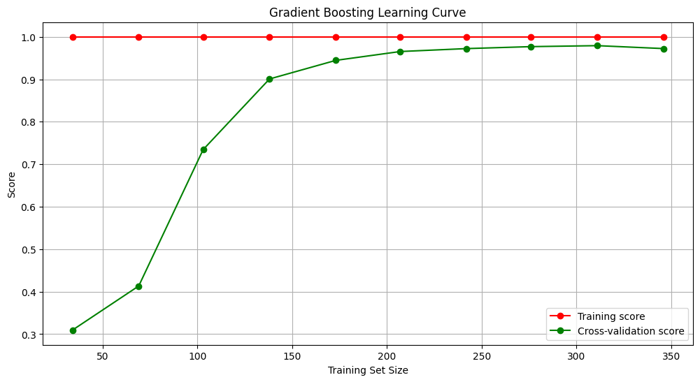 style="width:5.51181in;height:3.01195in" />
>
> 0 1 2 3 4 5 6 7
>
> accuracy macro avg weighted avg

Precision Recall

> 0.75 1.00 1.00 1.00 1.00 1.00 1.00 1.00 1.00 1.00 1.00 1.00 1.00 0.88
> 1.00 1.00
>
> 0.97 0.98 0.98 0.98

F1-score

> 0.86 1.00 1.00 1.00 1.00 1.00 0.93 1.00
>
> 0.98 0.97 0.98

Support

> 3 6 6 9 3 3 8 6
>
> 44 44 44
>
> 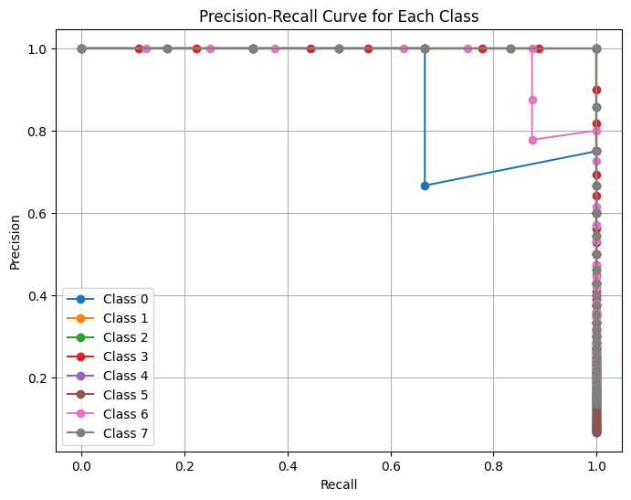 style="width:2.83462in;height:2.2439in" /> style="width:2.48035in;height:2.3079in" />Table 5.4: Gradient Boosting
> Classification Report
>
> Figure 5.9: Gradient Boosting Precision-Recall Curves

Figure 5.10: Gradient Boosting Con-fusion Matrix

> Figure 5.11: Gradient Boosting Learning Curve
>
> 31
>
> 5\. Result Analysis BPL MATCH WINNER PREDICTION
>
> 5.2 Model Accuracy & Compare
>
> Now, We compare the performance of four machine learning models:
> Gradient Boosting, Random Forest, XGBoost, and Decision Tree. The
> accuracy of each model is summarized in Table 5.13 and visually
> represented in Figure 5.12.
>
> 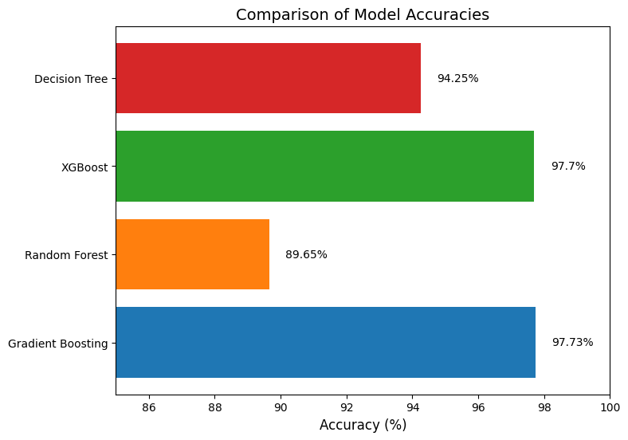 style="width:2.24399in;height:1.57193in" />As shown, Gradient Boosting
> achieves the highest accuracy at 97.73%, followed closely by XGBoost
> at 97.70%. Both models are well-known for their ensemble-based
> learning techniques, which improve performance by combining multiple
> weak learners to form a strong predictive model. On the other hand,
> the Decision Tree model performs relatively well with an accuracy of
> 94.25%, but it is noticeably lower than the ensemble-based meth-ods.
> The Random Forest model, which is also an ensemble of decision trees,
> achieves an accuracy of 89.65%, making it the least accurate model in
> this comparison.

||
||
||
||

> Figure 5.12: Accuracy compares Figure 5.13: Model Accuracy
>
> The results demonstrate that ensemble methods like Gradient Boosting
> and XGBoost generally outperform single decision tree-based models in
> terms of accuracy, which high-lights their strength in handling
> complex, non-linear relationships in the data.
>
> 5.3 Output
>
> The final implementation of the BPL (Bangladesh Premier League) Match
> Winner Pre-diction model involves a user interface built using Flask
> and a machine learning model. The interface allows users to input
> various match details, which the model uses to predict the winner of
> the match. The user inputs the following:
>
> • Season • Team 1
>
> • Team 1 Score
>
> • Team 1 Wickets • Team 2
>
> • Toss Winner • Toss Decision • City
>
> • Venue
>
> • Umpire 1 • Umpire 2
>
> After filling out the form with the relevant match details, the user
> clicks on the ”Predict Winner” button. The model processes the input
> data and predicts the winning team.
>
> As shown in Figure 5.14, the predicted winner is displayed on the
> interface. In this example, the input details indicate a match between
> Comilla and Chattogram, with the model predicting ”Chattogram” as the
> winner.
>
> 32
>
> 5\. Result Analysis BPL MATCH WINNER
> PREDICTION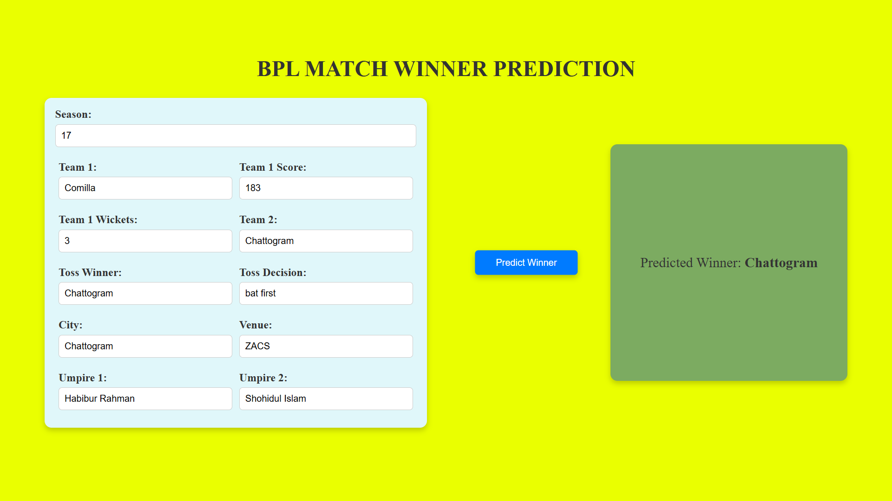 style="width:5.51147in;height:3.1002in" />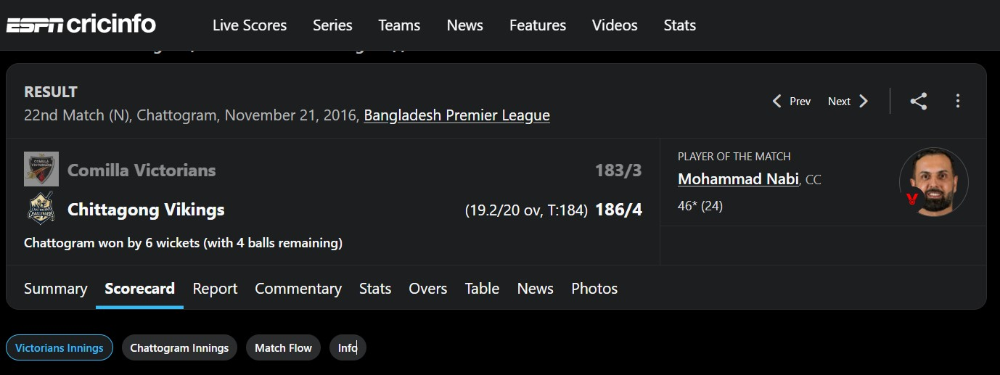 style="width:5.5119in;height:2.06796in" />
>
> Figure 5.14: User interface showing the BPL match winner prediction.
>
> This user-friendly interface allows users to easily predict the
> outcome of a BPL match by entering essential match details. The system
> leverages historical data and machine learning to provide an accurate
> prediction based on the input features.
>
> 5.4 Output Verification
>
> To verify the accuracy of the predicted match winner, we compared the
> output generated by our model with the actual match results available
> on ESPN Cricinfo \[1\].
>
> As shown in Figure 5.15, the model correctly predicted ”Chattogram” as
> the winner of the match. The actual result, as reported by ESPN
> Cricinfo, confirms that Chattogram Vikings won the match against
> Comilla Victorians by 6 wickets, with 4 balls remaining.
>
> This verification demonstrates that the model is capable of accurately
> predicting the outcome of BPL matches using the input parameters
> provided.
>
> Figure 5.15: Actual match result from ESPN Cricinfo confirming the
> predicted winner.
>
> 33
>
> CHAPTER 6
>
> FUTURE SCOPE
>
> These future work suggestions offer insightful directions for
> improving the cricket match prediction model:
>
> Enhanced Feature Engineering
>
> Implementing advanced feature engineering techniques can boost the
> model’s predic-tive capabilities.
>
> • Time Series Analysis: Analyzing trends in player performances over
> time could uncover patterns that are predictive of future match
> outcomes.
>
> • Sentiment Analysis: Gathering insights from social media platforms
> or team news could help predict a team’s form or player morale, which
> could impact match results.
>
> • Player Impact Scores: Incorporating complex metrics such as player
> impact scores (considering both batting, bowling, and fielding
> contributions) would provide more granular data to enhance prediction
> accuracy.
>
> Incorporation of External Factors Adding real-world variables such as:
>
> • Weather Conditions: Factors like rain, humidity, and temperature can
> influence how players perform or the nature of the pitch.
>
> • Player Injuries: Missing key players could alter a team’s dynamics.
>
> • Venue-Specific Characteristics: Capturing pitch behavior, boundary
> sizes, and the crowd’s influence would help predict match outcomes
> more effectively, consider-ing these external forces.
>
> Deep Learning Approaches
>
> • Recurrent Neural Networks (RNNs): This deep learning technique is
> suited for processing sequential data and could model the
> time-dependent nature of cricket events.
>
> • Convolutional Neural Networks (CNNs): Though commonly used for
> images, CNNs could be applied to spatial patterns in cricket, like
> field placements or even player movements.
>
> • These models can learn complex, hidden patterns that might be missed
> by traditional machine learning algorithms.
>
> 34
>
> 6\. Future Scope BPL MATCH WINNER PREDICTION
>
> Real-time and Streaming Data
>
> • Introducing real-time capabilities can enhance the system’s
> applicability to live matches, allowing predictions to evolve as the
> game progresses.
>
> • This would require implementing algorithms capable of processing and
> updating pre-dictions dynamically based on ongoing events, such as
> wickets falling, partnerships building, or changing weather
> conditions.
>
> These enhancements would make the predictive system more robust,
> dynamic, and capable of handling diverse, real-world scenarios,
> leading to more accurate predictions.
>
> 35
>
> CHAPTER 7
>
> LIMITATIONS
>
> Here the some limitations to consider for a cricket winner prediction
> model
>
> Data Quality and Availability
>
> • Limited Historical Data: The model’s accuracy depends heavily on the
> quality and amount of historical data. Limited access to detailed past
> matches, especially for smaller or less popular tournaments, can
> hinder the model’s performance.
>
> • Inaccurate Data: Errors in historical data, such as missing entries
> or incorrect statistics, can negatively impact predictions.
>
> Unpredictability of Cricket
>
> • Cricket is Highly Unpredictable: Matches can change direction
> quickly based on key moments, such as a sudden collapse of wickets or
> a significant weather change. These events are dificult to predict
> even with sophisticated models.
>
> • Impact of External Factors: Factors like player injuries during a
> match, sudden rain interruptions, or pitch conditions on the day may
> not be fully captured by the model, leading to less accurate
> predictions.
>
> Real-time Data Challenges
>
> • Latency in Real-time Updates: Updating the prediction in real-time
> can be challenging due to delays in acquiring and processing live
> data. Even slight delays can affect the accuracy of predictions.
>
> • Dynamic Game Situations: Cricket matches evolve dynamically, and a
> model trained on historical data may struggle to adapt instantly to
> changing game condi-tions, like an unexpected batting collapse.
>
> Generalization Across Formats
>
> • Different Formats: Cricket has multiple formats (Test, ODI, T20),
> each with distinct strategies and gameplay. A model trained on one
> format might not perform well on another, as the importance of
> features (e.g., run rate, strike rate) differs across formats.
>
> Dificulty in Modeling Human Factors
>
> 36
>
> 7\. Limitations
>
> • Psychological Factors:
>
> BPL MATCH WINNER PREDICTION

Player form, team morale, and pressure situations are

> subjective aspects that are hard to quantify and include in the model.
>
> • Captaincy and Team Decisions: Strategic decisions made by the
> captain, such as field placements or bowling changes, can have a huge
> impact, but they are not easily predictable using data.
>
> Limited Scope of Features
>
> • Ignoring Complex Player Interactions: Models might oversimplify
> player in-teractions. For example, how certain bowlers perform against
> specific batsmen, or the role of partnerships between players.
>
> • Contextual Factors: Features such as crowd influence, team rivalry,
> and the psy-chological impact of critical moments in a match are hard
> to model quantitatively.
>
> Computational Resource Demands
>
> • Real-time Predictions Require High Resources: Predicting the outcome
> in real-time during live matches requires significant computational
> resources to process data and run the model eficiently.
>
> Addressing these limitations will require ongoing refinement of the
> model and addi-tional data sources to improve the robustness and
> accuracy of predictions.
>
> 37
>
> CHAPTER 8
>
> CONCLUSION
>
> This project showcases the significant potential of machine learning
> in predicting the outcomes of cricket matches, particularly in the
> Bangladesh Premier League (BPL). By developing a tailored dataset, we
> leveraged advanced machine learning algorithms like XGBoost and
> Gradient Boosting to generate accurate predictions. These models
> helped identify key factors influencing match outcomes, such as player
> performance, pitch condi-tions, and game dynamics.
>
> The application of these predictive models goes beyond just match
> outcomes. It en-hances fan engagement by providing data-driven
> insights that allow fans to make informed predictions. For teams, it
> offers strategic value by aiding in decision-making processes, such as
> player selection and in-game tactics.
>
> Additionally, this project contributes to the growing field of sports
> analytics by demon-strating how machine learning can be effectively
> applied to complex sports like cricket. Despite the progress,
> challenges remain—particularly in managing the game’s dynamic nature
> and real-time events. However, the insights gained through this work
> provide a solid foundation for future advancements in cricket
> prediction, paving the way for more sophisticated models and
> applications.
>
> 38
>
> BIBLIOGRAPHY
>
> \[1\] Bangladesh premier league (bpl) records. Available online: [ESPN
> Cricinfo.](https://www.espncricinfo.com/records/trophy/bangladesh-premier-league-159)
>
> \[2\] N. Abhishek, P. Shivanee, N. Minakshee, and M. Sahil. Winning
> prediction analysis in one-day-international (odi) cricket using
> machine learning techniques. International Journal of Emerging
> Technology and Computer Science, 3(2):137–144, 2018.
>
> \[3\] A. Ahmed, R. Khan, and M. Ali. Analyzing the performance of the
> pakistan cricket team using machine learning. Journal of Sports
> Analytics, 12(4):345–360, 2023.
>
> \[4\] Mazhar Javed Awan, Syed Arbaz Haider Gilani, Hamza Ramzan,
> Haitham Nobanee, Awais Yasin, Azlan Mohd Zain, and Rabia Javed.
> Cricket match analytics using the big data approach. Electronics,
> 10(19):2350, 2021.
>
> \[5\] Milon Biswas, Tajim Md Niamat Ullah Akhund, Md Kawsher Mahbub,
> Sikder Md Saiful Islam, Sadia Sorna, and M. Shamim Kaiser. A survey on
> predicting player’s performance and team recommendation in game of
> cricket using machine learning. In Information and Communication
> Technology for Competitive Strategies (ICTCS 2020) ICT: Applications
> and Social Interfaces, pages 223–230. Springer Singapore, 2022.
>
> \[6\] Minhaj Uddin Hassan. Bpl dataset, 2024. Available online:
> [Kaggle](https://www.kaggle.com/datasets/minhajuddinhassan/bpl-dataset)
> (accessed on: July 10, 2024).
>
> \[7\] M. S. Islam, M. A. H. Chowdhury, and M. A. H. Bhuiyan.
> Predicting bpl match winners: An empirical study using machine
> learning approach, 2024. Available online:
> [(a](https://www.researchgate.net/publication/375884996_Predicting_BPL_Match_Winners_An_Empirical_Study_Using_Machine_Learning_Approach)ccessed
> on: August 1, 2024).
>
> \[8\] K. Kapadia, H. Abdel-Jaber, F. Thabtah, and W. Hadi. Sport
> analytics for cricket game results using machine learning: An
> experimental study. Applied Computing and Informatics, 2020.
>
> \[9\] J. Kumar, R. Kumar, and P. Kumar. Outcome prediction of odi
> cricket matches using decision trees and mlp networks. In 2018 First
> International Conference on Secure Cyber Computing and Communication
> (ICSCCC), pages 343–347. IEEE, 2018.
>
> \[10\] R. Lamsal and A. Choudhary. Predicting outcome of indian
> premier league (ipl) matches using machine learning. arXiv preprint
> arXiv:1809.09813, 2018.
>
> \[11\] T. Mahmood, M. Riaz, M. Nasir, U. Afzal, and M. H. Siddiqui.
> Psl eye: Predicting the winning team in pakistan super league (psl)
> matches. KIET Journal of Computing and Information Sciences,
> 4(2):13–13, 2021.
>
> 39
>
> BIBLIOGRAPHY BPL MATCH WINNER PREDICTION
>
> \[12\] Harsh Mittal, Deepak Rikhari, Jitendra Kumar, and Ashutosh
> Kumar Singh. A study on machine learning approaches for player
> performance and match results prediction. arXiv preprint
> arXiv:2108.10125, 2021.
>
> \[13\] N. Pathak and H. Wadhwa. Applications of modern classification
> techniques to predict the outcome of odi cricket. In Procedia Computer
> Science, volume 87, pages 55–60, 2016.
>
> \[14\] M. M. Rahman, M. O. F. Shamim, and S. Ismail. An analysis of
> bangladesh one day international cricket data: a machine learning
> approach. In 2018 International Conference on Innovations in Science,
> Engineering and Technology (ICISET), pages 190–194. IEEE, 2018.
>
> \[15\] Vignesh Veppur Sankaranarayanan, Junaed Sattar, and Laks VS
> Lakshmanan. Auto-play: A data mining approach to odi cricket
> simulation and prediction. In Proceedings of the 2014 SIAM
> International Conference on Data Mining, pages 1064–1072. Society for
> Industrial and Applied Mathematics, 2014.
>
> \[16\] S. Singh, Y. Aggarwal, and K. Kundu. Quantitative analysis of
> forthcoming icc men’s t20 world cup 2020 winner prediction using
> machine learning. International Journal of Computer Applications,
> 975:8887, 2020.
>
> \[17\] K. C. Srikantaiah, Aryan Khetan, Baibhav Kumar, Divy Tolani,
> and Harshal Patel. Prediction of ipl match outcome using machine
> learning techniques. In 3rd Inter-national Conference on Integrated
> Intelligent Computing Communication & Security (ICIIC 2021), pages
> 399–406. Atlantis Press, 2021.
>
> \[18\] Pallavi Tekade, Kunal Markad, Aniket Amage, and Bhagwat
> Natekar. Cricket match outcome prediction using machine learning.
> International Journal, 5(7), 2020.
>
> \[19\] A. Tripathi, R. Islam, V. Khandor, and V. Murugan. Prediction
> of ipl matches using machine learning while tackling ambiguity in
> results. Indian Journal of Science and Technology, 13(38):4013–4035,
> 2020.
>
> \[20\] Daniel Mago Vistro, Faizan Rasheed, and Leo Gertrude David. The
> cricket winner prediction with application of machine learning and
> data analytics. International Journal of Scientific & Technology
> Research, 8(09), 2019.
>
> \[21\] C. K. Vora, M. N. Khandelwal, and A. A. Khandare. Performance
> analysis of classi-fication algorithms for outcome prediction of t20
> cricket tournament matches, 2022. Published on ResearchGate.
>
> \[22\] Wikipedia contributors. Bangladesh premier league, 2024.
> Accessed: 2024-09-13.
>
> 40
